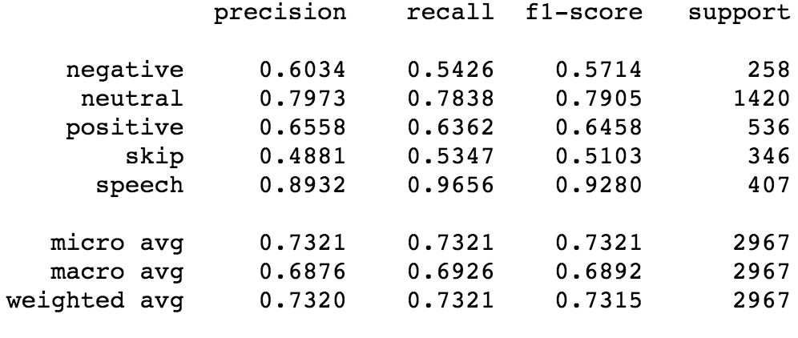
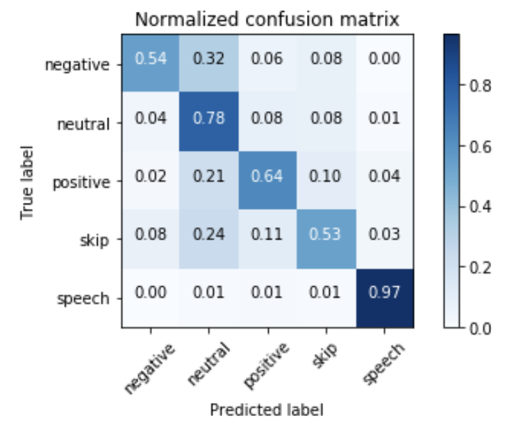

**ULMFiT - Russia - Experiments Workflow and Results** 
----------------------------------------
Hello. Here is work on ULMFiT for Russian language.

What is done:
- pretraining language model from wiki-dump on 100M
- finetuning LM with data from http://study.mokoron.com/
- work on “Rusentiment” classification task (http://text-machine.cs.uml.edu/projects/rusentiment/), which is multiclass and noisier than the previous one. I’ve managed to replicate SOTA (~0.73 F1 score)

My fork has all readmes from parent repo and my experiments are in experiments folder.
____________________
*Workflow:*
- all wiki downloading and processing as in parent repo
- [This file](wiki-100-lm-rusent-class-v1.ipynb) file is for training LM on 100M wiki, tune LM on tweets from ruSentEval (2M sample of all the data) and classify ruSentiment task
- To download ruSentiment data you need to run [get-ruSentiment-data.ipynb](get-ruSentiment-data.ipynb) 
- It's a bit trickier to get twitter data to finetune LM
    1. You need to download database dump of ~17M tweets from http://study.mokoron.com/
    2. You need to up mysql database from this dump
    3. With help of [take-data-from-db.ipynb code](take-data-from-db.ipynb) you can get all the data to csv file
    4. You need to fix data with [fix-data-from-db.ipynb file](fix-data-from-db.ipynb)
    5. I'm sure it's not a straightforward way and should be reconsidered somehow.
___________________
*Results:*

Classification report from evaluation of best model

Normalized confusion matrix:

This work is on fastai v1. All notebooks are self-explanatory and have some comments. 
Feel free to ask questions, comment and provide suggestion
